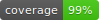
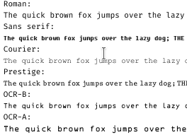
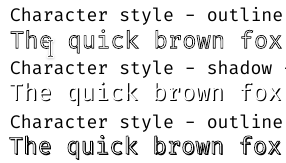
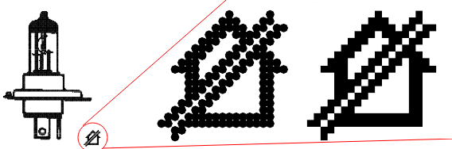
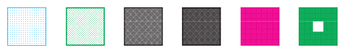
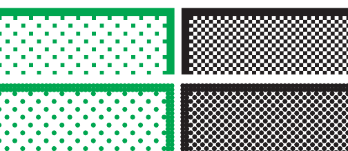
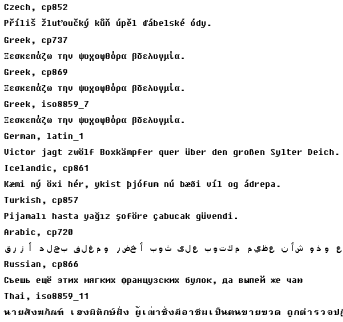

[](https://github.com/ysard/escapy/releases/latest/)
[](https://github.com/ysard/escapy/actions)
[](https://interrogate.readthedocs.io/en/latest/)
[](https://docs.pytest.org/en/latest/)
[](https://pypi.python.org/pypi/esca-py)
[](https://github.com/ysard/escapy/blob/main/LICENCE)
[](https://liberapay.com/Ysard/donate)
<!--[](https://escapy.readthedocs.io/en/latest/)-->


EscaPy is a tool that **reliably** and almost **exhaustively** interprets the
ESC/P and ESC/P2 command sets defined by Epson
([Wikipedia - Epson ESC/P](https://en.wikipedia.org/wiki/ESC/P)), then converts
the data formerly intended for printers into a modern PDF file.

**TL;DR**: Your DOS system or emulator will be able to produce searchable
PDF files.
This tool is compatible with files produced by the
[Libre Printer](https://github.com/ysard/libre-printer) interface discussed below.


## Foreword

Nowadays, older equipment may still be in use in sectors such as medical or
industrial (machine tools). While the software of the old days were often
designed to use dot-matrix printers exclusively, these printers can break down
or can no longer be used due to a lack of consumables available on the market.

As a result, the entire system has to be replaced without justification.

EscaPy generates PDF files from the raw data sent to the printer.
Files can therefore be stored permanently, printed on new hardware, indexed by
an archiving system (text remains accessible) or simply consulted at any time.

Note that data destined for the printer must be captured in some way.
The [Libre Printer](https://github.com/ysard/libre-printer) project accomplishes
exactly this task by providing a software and hardware interface pretending
to be a printer compatible with older hardware.


## Donations

EscaPy is a project that took ~2 months of full-time work for its first version.
If it has been useful to you in any way and you would like to contribute to its
development, please follow the link below, with all thanks :

[](https://liberapay.com/Ysard/donate)


1EB6dc6YULzHR4TMqLi5fomZ6wmdP3N5cW


## Features

-[x] **Advanced ESC/P ESC/P2 command set support**

    Nearly all commands are supported (text, graphics and barcodes).

    <details>
   <summary><b>See details</b></summary>

    *: Not recommended command.

    | Setting the page format          |                                             |                      |
    |----------------------------------|---------------------------------------------|----------------------|
    | ESC ( C                          | Set page length in defined unit             | :white_check_mark:   |
    | ESC ( c                          | Set page format                             | :white_check_mark:   |
    | ESC C                            | Set page length in lines                    | :white_check_mark:   |
    | ESC C NUL                        | Set page length in inches                   | :white_check_mark:   |
    | ESC N                            | Set bottom margin                           | :white_check_mark:   |
    | ESC O                            | Cancel bottom margin                        | :white_check_mark:   |
    | ESC Q                            | Set right margin                            | :white_check_mark:   |
    | ESC l                            | Set left margin                             | :white_check_mark:   |
    |                                  |                                             |                      |
    | Moving the print position        |                                             |                      |
    | CR                               | Carriage return                             | :white_check_mark:   |
    | LF                               | Line feed                                   | :white_check_mark:   |
    | FF                               | Form feed                                   | :white_check_mark:   |
    | ESC $                            | Set absolute horizontal print position      | :white_check_mark:   |
    | ESC \                            | Set relative horizontal print position      | :white_check_mark:   |
    | ESC ( V                          | Set absolute vertical print position        | :white_check_mark:   |
    | ESC ( v                          | Set relative vertical print position        | :white_check_mark:   |
    | ESC J                            | Advance print position vertically           | :white_check_mark:   |
    | HT                               | Tab horizontally                            | :white_check_mark:   |
    | VT                               | Tab vertically                              | :white_check_mark:   |
    | ESC f                            | Horizontal/vertical skip*                   | :white_check_mark:   |
    | BS                               | Backspace*                                  | :white_check_mark:   |
    |                                  |                                             |                      |
    | Setting the units                |                                             |                      |
    | ESC ( U                          | Set unit                                    | :white_check_mark:   |
    | ESC 0                            | Select 1/8-inch line spacing                | :white_check_mark:   |
    | ESC 2                            | Select 1/6-inch line spacing                | :white_check_mark:   |
    | ESC 3                            | Set n/180-inch line spacing                 | :white_check_mark:   |
    | ESC 3                            | Set n/216-inch line spacing                 | :white_check_mark:   |
    | ESC +                            | Set n/360-inch line spacing                 | :white_check_mark:   |
    | ESC A                            | Set n/60-inch line spacing*                 | :white_check_mark:   |
    | ESC A                            | Set n/72-inch line spacing*                 | :white_check_mark:   |
    | ESC 1                            | Select 7/72-inch line spacing*              | :white_check_mark:   |
    | ESC D                            | Set horizontal tabs                         | :white_check_mark:   |
    | ESC B                            | Set vertical tabs                           | :white_check_mark:   |
    | ESC b                            | Set vertical tabs in VFU channels*          |                      |
    | ESC /                            | Select vertical tab channel*                |                      |
    | ESC e                            | Set fixed tab increment*                    |                      |
    | ESC a                            | Select justification*                       |                      |
    |                                  |                                             |                      |
    | Selecting characters             |                                             |                      |
    | ESC ( t                          | Assign character table                      | :white_check_mark:   |
    | ESC t                            | Select character table                      | :white_check_mark:   |
    | ESC R                            | Select an international character set       | :white_check_mark:   |
    | ESC &                            | Define user-defined characters              | :white_large_square: |
    | ESC :                            | Copy ROM to RAM                             | :white_check_mark:   |
    | ESC %                            | Select user-defined set                     | :white_check_mark:   |
    | ESC x                            | Select LQ or draft                          | :white_check_mark:   |
    | ESC x                            | Select NLQ or draft                         | :white_check_mark:   |
    | ESC k                            | Select typeface                             | :white_check_mark:   |
    | ESC X                            | Select font by pitch and point              | :white_check_mark:   |
    | ESC c                            | Set horizontal motion index (HMI)           | :white_large_square: |
    | ESC P                            | Select 10.5-point, 10-cpi                   | :white_check_mark:   |
    | ESC P                            | Select 10-cpi                               | :white_check_mark:   |
    | ESC M                            | Select 10.5-point, 12-cpi                   | :white_check_mark:   |
    | ESC M                            | Select 12-cpi                               | :white_check_mark:   |
    | ESC g                            | Select 10.5-point, 15-cpi                   | :white_check_mark:   |
    | ESC g                            | Select 15-cpi                               | :white_check_mark:   |
    | ESC p                            | Turn proportional mode on/off               | :white_check_mark:   |
    | ESC SP                           | Set intercharacter space                    | :white_check_mark:   |
    | ESC E                            | Select bold font                            | :white_check_mark:   |
    | ESC F                            | Cancel bold font                            | :white_check_mark:   |
    | ESC 4                            | Select italic font                          | :white_check_mark:   |
    | ESC 5                            | Cancel italic font                          | :white_check_mark:   |
    | ESC !                            | Master select                               | :white_check_mark:   |
    | ESC G                            | Select double-strike printing               | :white_check_mark:   |
    | ESC H                            | Cancel double-strike printing               | :white_check_mark:   |
    | ESC -                            | Turn underline on/off                       | :white_check_mark:   |
    | ESC ( -                          | Select line/score                           | :white_check_mark:   |
    | ESC S                            | Select superscript/subscript printing       | :white_check_mark:   |
    | ESC T                            | Cancel superscript/subscript printing       | :white_check_mark:   |
    | ESC q                            | Select character style                      | :white_check_mark:   |
    | SI                               | Select condensed printing                   | :white_check_mark:   |
    | ESC SI                           | Select condensed printing*                  | :white_check_mark:   |
    | DC2                              | Cancel condensed printing                   | :white_check_mark:   |
    | SO                               | Select double-width printing (one line)     | :white_check_mark:   |
    | ESC SO                           | Select double-width printing (one line)*    | :white_check_mark:   |
    | DC4                              | Cancel double-width printing (one line)     | :white_check_mark:   |
    | ESC W                            | Turn double-width printing on/off           | :white_check_mark:   |
    | ESC w                            | Turn double-height printing on/off          | :white_check_mark:   |
    |                                  |                                             |                      |
    | Control-code character printing  |                                             |                      |
    | ESC ( ^                          | Print data as characters                    | :white_check_mark:   |
    | ESC 6                            | Enable printing of upper control codes      | :white_check_mark:   |
    | ESC 7                            | Enable upper control codes                  | :white_check_mark:   |
    | ESC I                            | Enable printing of control codes            | :white_check_mark:   |
    | ESC m                            | Select printing of upper control codes*     | :white_check_mark:   |
    |                                  |                                             |                      |
    | Mechanical control               |                                             |                      |
    | ESC EM                           | Control paper loading/ejecting              | :white_large_square: |
    | ESC U                            | Turn unidirectional mode on/off             | :no_entry_sign:      |
    | ESC <                            | Unidirectional mode (one line)*             | :no_entry_sign:      |
    | BEL                              | Beeper*                                     | :no_entry_sign:      |
    | ESC 8                            | Disable paper-out detector*                 | :no_entry_sign:      |
    | ESC 9                            | Enable paper-out detector*                  | :no_entry_sign:      |
    | ESC s                            | Select low-speed mode*                      | :no_entry_sign:      |
    |                                  |                                             |                      |
    | Printing color and graphics      |                                             |                      |
    | ESC ( G                          | Select graphics mode                        | :white_check_mark:   |
    | ESC ( i                          | Select MicroWeave print mode                | :white_check_mark:   |
    | ESC .                            | Print raster graphics                       | :white_check_mark:   |
    | ESC . 2                          | Enter TIFF compressed mode                  | :white_check_mark:   |
    | ESC *                            | Select bit image                            | :white_check_mark:   |
    | ESC ?                            | Reassign bit-image mode*                    | :white_check_mark:   |
    | ESC K                            | Select 60-dpi graphics*                     | :white_check_mark:   |
    | ESC L                            | Select 120-dpi graphics*                    | :white_check_mark:   |
    | ESC Y                            | Select 120-dpi, double-speed graphics*      | :white_check_mark:   |
    | ESC Z                            | Select 240-dpi graphics*                    | :white_check_mark:   |
    | ESC ^                            | Select 60/120-dpi, 9-pin graphics           | :white_check_mark:   |
    | ESC r                            | Select printing color                       | :white_check_mark:   |
    |                                  |                                             |                      |
    | Printing bar codes               |                                             |                      |
    | ESC ( B                          | Bar code setup and print                    | :white_check_mark:   |
    |                                  |                                             |                      |
    | Data and memory control          |                                             |                      |
    | ESC @                            | Initialize printer                          | :white_check_mark:   |
    | CAN                              | Cancel line*                                |                      |
    | DEL                              | Delete last character in buffer*            |                      |
    | DC1                              | Select printer*                             | :no_entry_sign:      |
    | DC3                              | Deselect printer*                           | :no_entry_sign:      |
    | ESC #                            | Cancel MSB control*                         |                      |
    | ESC =                            | Set MSB to 0*                               |                      |
    | ESC >                            | Set MSB to 1*                               |                      |
    |                                  |                                             |                      |
    | Deleted commands                 |                                             |                      |
    | ESC j                            | Reverse paper feed*                         | :no_entry_sign:      |
    | ESC i                            | Select immediate print mode*                | :no_entry_sign:      |
    |                                  |                                             |                      |
    | Binary mode commands for ESC . 2 |                                             |                      |
    | raster graphics compression mode |                                             |                      |
    | `<XFER>`                         | Transfer raster graphics data               | :white_check_mark:   |
    | `<MOVX>`                         | Set relative horizontal position            | :white_check_mark:   |
    | `<MOVY>`                         | Set relative vertical position              | :white_check_mark:   |
    | `<COLR>`                         | Select printing color                       | :white_check_mark:   |
    | `<CR>`                           | Carriage return to left-most print position | :white_check_mark:   |
    | `<EXIT>`                         | Exit TIFF compressed mode                   | :white_check_mark:   |
    | `<MOVXBYTE>`                     | Set <MOVX> unit to 8 dots                   | :white_check_mark:   |
    | `<MOVXDOT>`                      | Set <MOVX> unit to 1 dot                    | :white_check_mark:   |

    </details>


-[x] **Advanced font support**

    Specify in advance the fonts you wish to use. 14 different fonts can be
    specified, each in 2 versions (fixed and proportional fonts), for a total of 28 fonts.

    Use system-installed or custom fonts.

    Text enhancements (strikethrough, underline, highlight, etc.) are supported.

    <div align="center"><figure>
      
      
      <figcaption>Fonts examples & character style implementations.</figcaption>
    </figure></div>


-[x] **Several rendering modes for graphic commands**

    Points can be rendered as dots or rectangles.
    In all cases, the file is vectorized (infinitely scalable).

    <div align="center"><figure>
      
      
      
      <figcaption>Graphic element magnifications. Two ways of rendering.</figcaption>
    </figure></div>

    NB: Rendering as an image is not yet available, but such a result can be
    obtained with GhostScript for this task (see examples).


-[x] **Searchable text**

    Text remains as text, not as images.
   This makes content search and indexing possible.


-[x] **Wide range of encodings available**

    A major effort has been made to ensure that the essential encodings of this
 era and more are also supported by EscaPy. It's easy to add to this list.
 Contributions are welcome.
 <br><br>
    Characters that can be printed in the place of the intervals dedicated to
 control characters, and international characters (National Replacement
 Character Set) are also injected into the encoding tables.

    <div align="center"><figure>
      
      <figcaption>Support for many common encodings.</figcaption>
    </figure></div>

    NB: It is still necessary to ensure that the fonts used support the selected
 character sets.

  <details>
    <summary><b>See details</b></summary>

    - [x] PC437 (US)
    - [x] PC437 Greek
    - [x] PC932 (Japanese)
    - [x] PC850 (Multilingual)
    - [ ] PC851 (Greek)
    - [ ] PC853 (Turkish)
    - [x] PC855 (Cyrillic)
    - [x] PC860 (Portugal)
    - [x] PC863 (Canada-French)
    - [x] PC865 (Norway)
    - [x] PC852 (East Europe)
    - [x] PC857 (Turkish)
    - [x] PC862 (Hebrew)
    - [x] PC864 (Arabic)
    - [x] PC AR864
    - [x] PC866 (Russian)
    - [ ] (Bulgarian ASCII****)
    - [ ] PC866 LAT. (Latvian)
    - [x] PC869 (Greek)
    - [ ] USSR GOST (Russian)
    - [ ] ECMA-94-1
    - [x] KU42 (K.U. Thai)
    - [ ] TIS11 (TS 988 Thai)
    - [ ] TIS18 (GENERAL Thai)
    - [ ] TIS17 (SIC STD. Thai)
    - [ ] TIS13 (IBM STD. Thai)
    - [ ] TIS16 (SIC OLD Thai)
    - [x] PC861 (Iceland)
    - [x] BRASCII
    - [x] Abicomp
    - [x] MAZOWIA (Poland)
    - [ ] Code MJK (CSFR)
    - [x] ISO8859-7 (Latin/Greek)
    - [x] ISO8859-1 (Latin 1)
    - [ ] TSM/WIN (Thai system manager)
    - [x] ISO Latin 1T (Turkish)
    - [ ] Bulgaria
    - [ ] Hebrew 7
    - [ ] Hebrew 8
    - [x] Roman 8
    - [x] PC774 (Lithuania)
    - [ ] Estonia (Estonia)
    - [x] ISCII
    - [x] PC-ISCII
    - [ ] PC APTEC
    - [ ] PC708
    - [x] PC720
    - [ ] OCR-B
    - [x] ISO Latin 1
    - [x] ISO 8859-2 (ISO Latin 2)
    - [x] ISO Latin 7 (Greek)
 </details>


-[x] **Page formats**

    47 portrait formats and their landscape equivalents are predefined.
    Custom sizes are also available.


-[x] **User-defined characters support (ESC/P2 only)**

    A user can send customized bitmap characters to the printer.
    A mapping file will be generated to map the received characters to modern
    unicode codes (see examples).


-[x] **Enhanced reliability thanks to testing (~100%)**

    EscaPy is an implementation of a standard made up of over 600 pages.

    A coverage rate close to 100% eliminates most of the erratic behavior that
    a non-rigorously tested application can produce.

    However, a coverage rate of 100% does not guarantee that the program
    rigorously follows the standard, but that its behavior is most often in line
    with what the developer expected when he designed it.


-[x] **Facilitated development**

    The code is fully documented to facilitate maintenance and enhancements.


## Setup

### Installation

All operating systems should be supported, although this project is mainly
developed for a GNU-Linux system as an everyday computer.

Simple installation from PyPi :
```bash
$ pip install esca-py
```

Installation from sources :
```bash
$ pip install .
```

Install the project in editable mode for developpers :
```bash
$ make install
# Or
$ pip install -e .[dev]
```

Installation on Debian : (coming soon)


### Usage

```bash
$ escapy -h
usage:  [-h] [--pins [PINS]] [--single_sheets | --no-single_sheets] [-o [OUTPUT]]
        [-c [CONFIG]] [-db [USERDEF_DB_FILEPATH]] [-v]
        esc_prn

positional arguments:
  esc_prn                ESC raw printer file. - to read from stdin.

options:
  -h, --help             show this help message and exit
  --pins [PINS]          number of needles of the print head (9, 24, 48). Leave it unset
                         for ESCP2 modern printers. (default: unset)
  --single_sheets, --no-single_sheets
                         single-sheets or continuous paper. (default: single-sheets)
  -o [OUTPUT], --output [OUTPUT]
                         PDF output file. - to write on stdout. (default: output.pdf)
  -c [CONFIG], --config [CONFIG]
                         configuration file to use. (default: ./escapy.conf,
                         ~/.local/share/escapy/escapy.conf)
  -db [USERDEF_DB_FILEPATH], --userdef_db_filepath [USERDEF_DB_FILEPATH]
                         mappings between user-defined chararacter codes and unicode.
                         (default: ./user_defined_mapping.json)
  -v, --version          show program's version number and exit
```

NB : The configuration file supplied by the application contains all the
information needed to configure the virtual printer (margins, page formats, etc.),
fonts and folders.

### Examples

Standard input/output streams are active, so it is possible to chain tools :

```bash
$ cat my_file.prn | escapy - -o - > my_pdf.pdf
```

For example, to convert the generated PDF into a TIFF image with GhostScript :

```bash
$ cat my_file.prn | escapy - -o - | \
gs -dBATCH -dNOPAUSE -dSAFER \
-dNoSeparationFiles -dSimulateOverprint=true -sDEVICE=tiffsep -r720 \
-sOutputFile=out-%d.tiff -
```

### Configuration file

The configuration file supplied by the application contains all the information
needed to configure the virtual printer (margins, page formats, etc.),
fonts and folders.

By default, the `escapy.conf` file is searched for in the current folder.
If it doesn't exist, it is searched for in the standard software configuration
folder on your system (see below).
This folder is created if it doesn't already exist.

On GNU/Linux systems:
`~/.local/share/escapy/`

On Windows systems:
`C:\\Users\\<YOUR_USERNAME>\\AppData\\Local\\escapy`

On MacOS systems:
`/Users/<YOUR_USERNAME>/Library/Application Support/escapy`

### Fonts

For reasons of licensing and personal preference, EscaPy does not embed fonts
(except for a minimal version of Courier and Helvetica).

<details>
<summary><b>List of fonts that can be embedded in Epson printers</b></summary>

* Roman
* Sans serif
* Courier
* Prestige
* Script
* OCR-B
* OCR-A
* Orator
* Orator-S
* Script C
</details>

Free fonts a proprietary equivalents :

| Proprietary                                                | Free ->                                                                                   |                                                                                                                        |                                                        |                                                            |                                                                |
|------------------------------------------------------------|-------------------------------------------------------------------------------------------|------------------------------------------------------------------------------------------------------------------------|--------------------------------------------------------|------------------------------------------------------------|----------------------------------------------------------------|
| Courier New                                                | Liberation Mono                                                                           | [Noto Sans Mono](https://fonts.google.com/noto)                                                                        | [FreeMono](https://en.wikipedia.org/wiki/GNU_FreeFont) | [Fira Mono, Fira Code](https://github.com/tonsky/FiraCode) | [Roboto Mono](https://fonts.google.com/specimen/Roboto+Mono)   |
| Times New Roman                                            | Liberation Serif                                                                          | Noto Serif                                                                                                             | FreeSerif                                              | [FiraGO](https://github.com/bBoxType/FiraGO)               | [Roboto Serif](https://fonts.google.com/specimen/Roboto+Serif) |
| Arial                                                      | Liberation Sans                                                                           | Noto Sans                                                                                                              | FreeSans                                               | [Fira Sans](https://fonts.google.com/specimen/Fira+Sans)   | [Roboto](https://fonts.google.com/specimen/Roboto)             |
| [OCR-A / OCR-B fonts](https://en.wikipedia.org/wiki/OCR-B) | [Square <br/>stroke ends OCR-A & OCR-B](https://ctan.org/tex-archive/fonts/ocr-b?lang=en) | [Rounded ends & extended character coverage OCR-B](https://web.archive.org/web/20190328165040/https://wehtt.am/ocr-b/) |

See also Recursive free font :

- [Recursive Mono](https://github.com/arrowtype/recursive)
- [Recursive Sans](https://github.com/arrowtype/recursive)

Free bitmap-style fonts :

- [Fixedsys Excelsior](https://github.com/kika/fixedsys)
- [Orp-Font](https://github.com/MicahElliott/Orp-Font)
- [~390 Atari fonts](https://github.com/a8bit/EightBit-Atari-Fonts)

Non-free fonts or fonts with restrictive licenses, often with a very limited
character set, but close to the embedded fonts on Epson printers :

- [Script C](https://online-fonts.com/fonts/scriptc)
- [Romant](https://online-fonts.com/fonts/romant)
- [Prestige](https://online-fonts.com/fonts/prestige)
- [OCR-A](https://online-fonts.com/fonts/ocrarus-lyajka)
- [OCR-B](https://www.freefontdownload.org/en/ocr-b-regular.font)

---

Noto, Free and Fira fonts are normally installed on most systems, but can also be
installed manually with the following command (on Debian systems and derivatives):

```bash
$ apt install fonts-noto fonts-freefont-ttf fonts-firacode
```

The same goes for Liberation fonts:
```bash
$ apt install fonts-liberation
```

Windows proprietary fonts can be installed with the following command:
```bash
$ apt install ttf-mscorefonts-installer
```

More generally, think of the `fnt` tool as a package manager for managing and
installing fonts.

### User-defined characters

A JSON file is created and updated when custom characters are found.
The user must specify the desired character in the unicode character set.
The changes will be applied to the PDF by restarting the software.

Example:
```
{
    "83e1a70_1": {
        "mode": 1,
        "proportional_spacing": false,
        "scripting": null,
        "1": "\ufffd"
    }
}
```

Here, a character is defined under the unique key `83e1a70_1`;
the character with code `1` in the table is momentarily associated with
the undefined character `\ufffd` (`UNDEFINED`).

A modification to match this code with the character `♫` could be as follows:
```
{
    "83e1a70_1": {
        "mode": 1,
        "proportional_spacing": false,
        "scripting": null,
        "1": "♫"
    }
}
```

By default, the JSON file (`user_defined_mapping.json`) is created in the current
folder, but this can be changed in the configuration file.
A folder containing the image of the bitmap character received can also be created.

### Unsupported encodings (Chinese, Japanese, etc.)

The ESC/P and ESC/P2 standards do not seem to support Chinese or Japanese
languages (encodings were apparently not provided for). However, some language
evolutions (ESC/POS, ESC/P-K, ESC/P J84) and printers do support this.
While in theory these languages can be implemented, their documentation remains
hard to find and is beyond the scope of the current project.
See [Wikipedia - ESC variants](https://en.wikipedia.org/wiki/ESC/P#Variants).

The easiest way to achieve this is to use the printer in graphics mode
(raster or bitimage) instead of text mode.


## Acknowledgements

- The management of modern fonts and their display on our screens would not
have been possible without the work of French engineer
[Pierre Bézier (1910-1999)](https://en.wikipedia.org/wiki/Pierre_B%C3%A9zier),
who also, through his work at Renault, revolutionized computer-aided design (CAD).

- The Epson-Seiko teams of the 90's deserve our thanks for producing complete
documentation of the language interpreted by their printers.


## Absence of acknowledgements

Since the 2010s, Epson-Seiko (like so many other brands) no longer publishes
language evolutions or advanced technical specifications for their machines.
The brand tends to consider that this is now an industrial secret and none of
your business.

In an ethical world, we wouldn't have to decipher these proprietary protocols.
If you too feel that this is not appropriate, then you should consider
manufacturers who respect your right to repair/modify what you own.


## Contributions

This project is open for any contribution! Any bug report can be posted by
opening an [issue](https://github.com/ysard/EscaPy/issues).


## License

EscaPy is distributed under two licenses: one for community use and the other
for commercial use.

### Community = Free and Open Source

EscaPy is released under the AGPL (Affero General Public License).

### Commercial

The aim is to limit the uses integrated into proprietary devices whose vendors
do not participate in the project in an equitable way, and who are guilty of
any violation of the EscaPy license or of the free software used by EscaPy itself.

If you are interested in this license, please contact us.

<p align="right"><a href="#readme-top">Top ⬆️</a></p>

---
 <div align="center">Built with ❤️ with <a href="https://github.com/luisvent/document_my_project">Document My Project</a></div>
